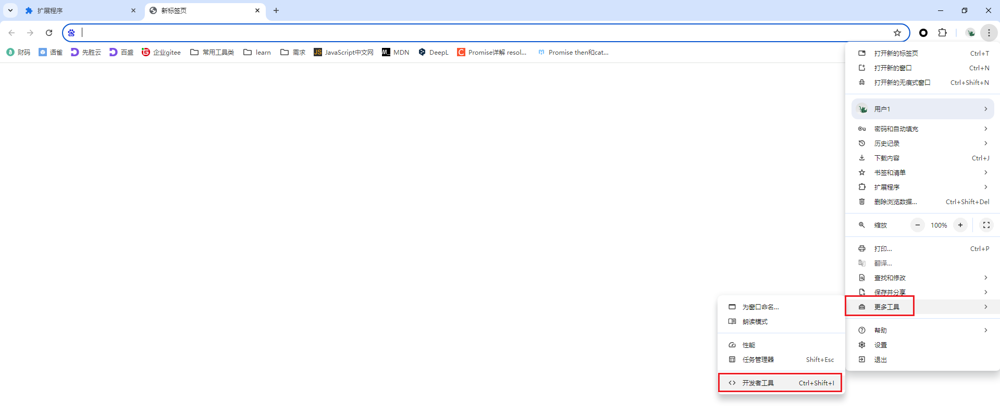
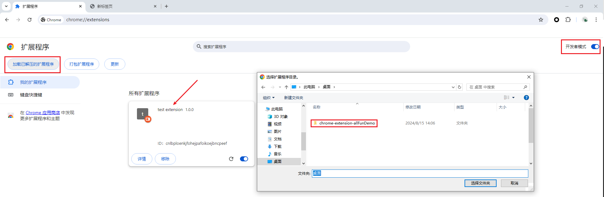

介绍：。。。

开发步骤：

1.根目录下必须新建 manifest.json 文件：记录重要的元数据，定义资源，声明权限，并标识哪些文件在后台和页面上运行。

按照官网教程[[清单文件格式  |  Manifest  |  Chrome for Developers](https://developer.chrome.com/docs/extensions/reference/manifest?hl=zh-cn#minimal-manifest)]，先添加最简单的 manifest 文件。

* `manifest.json` 必须位于项目的根目录下。
* 唯一的必需键为 `"manifest_version"`、`"name"` 和 `"version"`。

```
{
  "manifest_version":3, // 用于指定扩展程序使用的清单文件格式版本，目前支持3，版本2无法上传到chrome商店
  "name":"test extension", // 长度上限为75字符，用于标识扩展程序
  "version":"1.0.0", // 用于标识扩展程序版本号
}
```

2. 打开 chrome 开发者工具，上传扩展进行调试。



打开 `开发者模式` 可以以文件夹的形式直接加载插件，否则只能安装 `.crx` 格式的文件[后续会提到]。



3.扩展安装完毕，接下来完善一下 `manifest`。

> ```json
> {
>     "manifest_version": 3,
>     "name": "test extension",
>     "version": "1.0.0",
>     "description": "这里是 description",
>     // 图标，有如下4种格式版本，用同一种版本也可
>     "icons": {
>         "16": "assets/images/sds.png", // 扩展程序页面和上下文菜单上的网站图标
>         "32": "assets/images/sds.png", // Windows 计算机通常需要此大小
>         "48": "assets/images/sds.png", // 显示在“扩展程序”页面上
>         "128": "assets/images/sds.png" // 安装时会显示在 Chrome 应用商店中
>     },
>     "background": {
>         "service_worker": "assets/js/background.js",
>         "type": "module"
>     },
>   }
> ```
